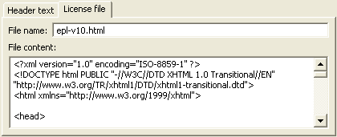
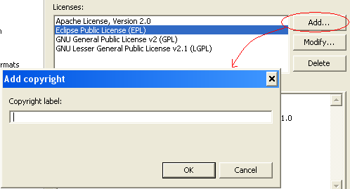

== Copyright preference page

The Copyright parameters allows one to define a set of standard licenses, including the text to be placed in the comment header of files, as well as a license file to add to the projects.

image::config02.png[]

[cols="2*", options="header"]
|===

|Parameter
|Description

|Owner
|Sets the value of the substitution variable `${owner}`. If not defined, it will take by default the same value that `${user}` variable.

|Licenses
|List of pre-configured licenses. Selecting an item on this list updates the fields in tabs.

|Header text
|Tab to define the text of the comment to be placed in the header of files. This text may contain substitution variables, which will be replaced by their values at the time of insertion of the comment in each target file. The text of the comment is defined line by line. It should not contain comment format characters specific to a file type (eg. `/* */`).

The usable substitution variables are:

`${owner}` - Value of the owner parameter

`${user}` - The OS user name

`${year}` - The current year

`${file_name}` - Name of the file on which the header is applied

`${file_absolute_path}` - Absolute path of the file on which the header is applied

`${file_path}` - Path of the file on which the header is applied, relative to the project root

`${project_name}` - Name of the project containing the file on which the header is applied

|License file
|Tab to set the (optional) license file to add to the projects.
|===

The *License file* tab allows you to associate a license file to a copyright definition:

 
[cols="2*", options="header"]
|===

|Parameter
|Description

|File name
|Default name of the license file. The file name may be changed if desired by the user within the parameters of the wizard.

|File content
|Text of the license. If the wanted file format is formatted, such as HTML, the text must contain all the formatting tags. The contents of the file is not interpreted, so the substitution variables do not apply here.
|===
The plugin is preconfigured with headers and licenses files for several open source licenses: Apache, Boost, BSD, (A)GPL, LGPL, MIT, and Mozilla. It is possible to add, change or delete any copyrights with the buttons Add, Modify, and Delete:

* Add - Add a new Copyright. A dialog box opens for the input of the label text under which the Copyright will be registered.
+
 
* Modify - Changing the label text of the copyright selected from the list.
* Delete - Remove the copyright selected from the list.

The *'Restore Defaults'* button will reload the default copyrights configuration file provided with the plug-in. All custom texts and copyrights will be lost.

