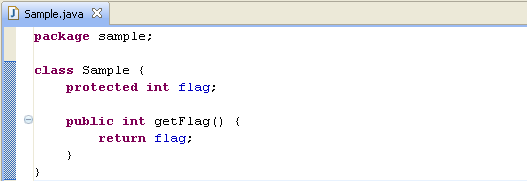

== Copyright wizard

The wizard is launched from the menu: *Project -> Copyright Wizard...*

image::menu.png[Apply copyright menu]

=== First page - Projects selection

The first page of the wizard lets you select one or more projects on which to apply the copyright.

image::step1.png[Wizard Step 1]

[cols="2*", options="header"]
|===

|Parameter
|Description

|Projects selection list
|Projects having copyright settings are marked in the selection list by a "\(C)" postfix on the projet name.

|Override projects copyright settings
|If checked, all projects copyright settings (headers text and formats) defined on selected projects will be override by the settings defined in the following page of the wizard.

|Override only the header comment text
|This checkbox is enabled only if the previous one is checked. If checked, the override of project copyright settings is limited to the header comment text. All the header formats defined in the projects preferences will be used by the wizard for the corresponding projects.
|===
=== Second page - Copyright parameters

The second page of the wizard lets you define the parameters of copyright to be applied to the selected projects. It is possible to define a completely specific copyright, or select a preconfigured copyright in the preferences of the wizard.

image::step2.png[Wizard Step 2]

[cols="2*", options="header"]
|===

|Parameter
|Description

|Copyright type
|Selection list of copyright to apply.
This list allows you to select one of the preconfigured copyrights in the preferences, or to choose the definition of a specific copyright (--- Custom copyright ---).

image:guide04.png[] 

|Copyright header text
|Text of comment header to be applied to the selected files. 
This field is pre-initialized with the text defined in preferences for the selected copyright.
It may, however, be changed if desired.

image:guide05.png[]

The text should not contain formatting comment characters.

|Include files
|Pattern of filenames on which apply the comment header.
If leaved empty, it is equivalent to "*" and all resources will be selected.
It is possible to give several patterns, separated by commas.
Then all resources corresponding at least to one of the patterns will be selected.

image:guide06.png[] 

|Exclude files
|Pattern of filenames to exclude from the selection defined by the include pattern.
If leaved empty, there is no exclusion.
It is possible to give several patterns, separated by commas.
Then all resources corresponding at least to one of the patterns will be excluded.

image:guide11.png[] 

|Replace existing headers
|This flag is used to indicate whether the wizard will replace the existing header files (checked) or if they should not be modified (unchecked).
The recognition of the existence of a header comment in a file is made by comparing the 5 first characters in the first line of the file (or the second one if the parameter "Do not override the first line" is checked in the corresponding format) with the 5 first characters of the first line defined in the header comment format.

|Add license file if not exists
|This flag allows you to add to selected projects a license file if no file with the same name already exists. This parameter is usable only for preconfigured copyrights having a license file defined.

|License file
|Name and path of the license file to create. This parameter is used only if the previous parameter has been selected. It is initialized by the file name defined in preferences settings for the selected copyright.
|===
=== Third page - Files selection

The wizard filters with the files patterns the files on which to apply the comment header. If the "Replace existing headers" has been checked, the files containing already a comment header are eligible for treatment. Otherwise they are also excluded from the pre-selection.

The last page of the wizard enables you to refine the selection. It presents the files filtered by the wizard.

image::step3.png[Wizard Step 3]

The user has the possibility to unselect files or directories on which apply the comment header. In the previous screenshot, files `config.properties` and `Sample2.java` were unselected and will therefore not be treated.

Finally click on *Finish* to start treatment on the selected files.

Example Java file before treatment:

Example Java file after treatment:

image::guide10.png[]

